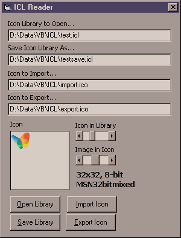



## ICL \- Icon Library File

### Description

This code reads from and write to an Icon Library format, a must for any icon editors. Stores multiple icons into a single file. As near as I can determine, this is the only shareware source code for reading and writing ICL files on the web, and I have done *extensive* searches! :-)

Special Thanks to Duncan Jones for putting me onto the Portable Execution format. The ICL is actually a 16-bit "New Executable" (NE) format DLL file used by 16-bit windows, but this format only contains a Resource table and only icons stored therein. Many Icon Editor programs (i.e. Microangelo 98) read and write these 16-bit ICL files, but there is no reason why ICL files cannot be written to a 32-bit "PE" DLL file formatted similarly.

Additionally this code also allows for the importing of icon files, and exporting of icons files, displays the count of the icons in the ICL, and the count of the images in each Icon. It returns the color depth in bits per pixel, width, and height of each Icon Image, and the name of the icon within the ICL. Thanks to the code from vbAccelerator, any particular Icon Image can be returned in a PictureBox.

Windows XP 32-bit icons are supported in the ICL library, but I do not have the alpha-blending of its Mask working just yet. Currently it treats all the non-white bits in the mask as part of the mask, so black is displayed. I have not tried it on my XP system yet, so if anyone has any ideas, please post a comment or email me directly.

Please leave me a comment, criticism, bug report, yada, yada, yada. Vote if you like, I am not looking for fame. =^-^=
 
### More Info
 

             |
---                |---
**Submitted On**   |2003-06-10 08:07:22
**By**             |[Rob Anderson](https://github.com/Planet-Source-Code/PSCIndex/blob/master/ByAuthor/rob-anderson.md)
**Level**          |Advanced
**User Rating**    |5.0 (55 globes from 11 users)
**Compatibility**  |VB 6\.0
**Category**       |[Graphics](https://github.com/Planet-Source-Code/PSCIndex/blob/master/ByCategory/graphics__1-46.md)
**World**          |[Visual Basic](https://github.com/Planet-Source-Code/PSCIndex/blob/master/ByWorld/visual-basic.md)
**Archive File**   |[ICL\_\-\_Icon1599096102003\.zip](https://github.com/Planet-Source-Code/rob-anderson-icl-icon-library-file__1-45931/archive/master.zip)

